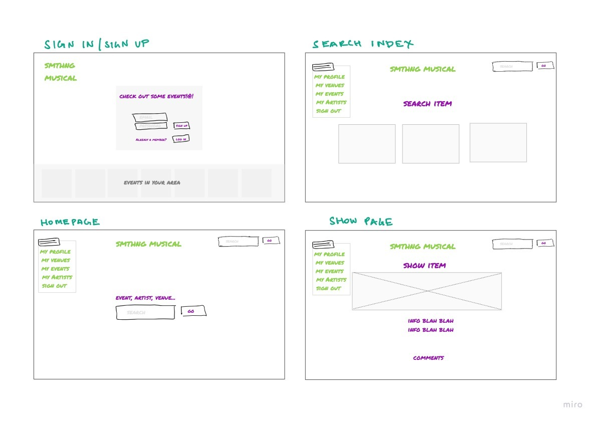

# Team MACK 

# Something Musical (SMTHNG MSCL) - project 3 *client*
- FrontEnd Development

### Description
Search for the artists you love, connect with other fans of similar music taste, and check out the upcoming events being put on by said artist at a venue near to you!
----------------------------------------------------------------------------

## USER STORY
**As A User:**
- Have the ability to find events, venues or artists that interests them 
- Have the ability to keep track of their favorite artists
- Events, Venues, Artists are all (models) that have the ability to be commented on by the user
- Users should be able to comment, like and maintain a favorites log of songs of their interest and on other songs as well 

## Technologies Used
- JavaScript
- Mongoose
- Express 
- Bootstrap

### Routes Table

This will be edited eventually to include more routes.......

| Endpoint         | Component | `AuthenticatedRoute`? |
|------------------|-------------------|-------|
| `/sign-up`       | `SignUp`    | No |
| `/sign-in`       | `SignIn`    | No |
| `/change-password` | `ChangePassword`  | Yes |
| `/sign-out`        | `SignOut`   | Yes |
 
# WireFrames 
